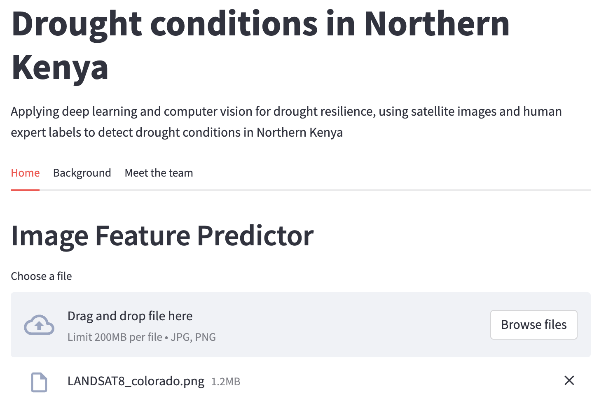
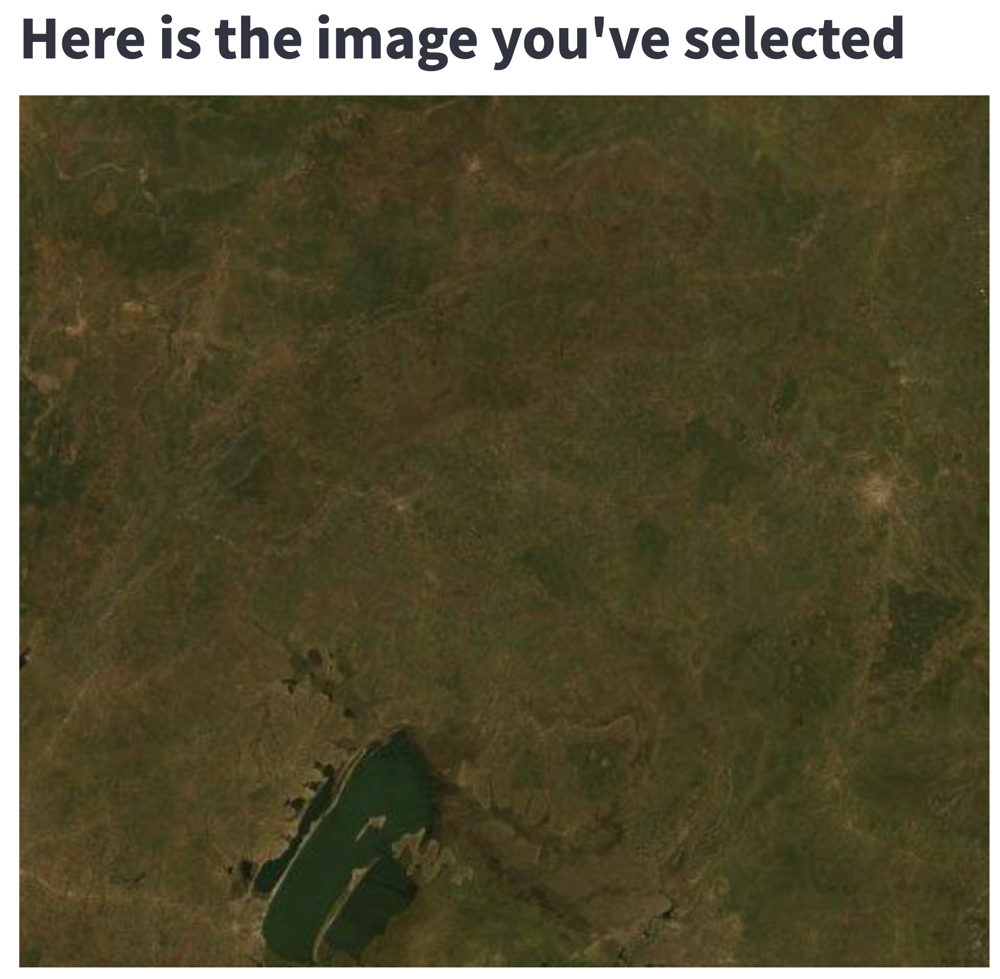
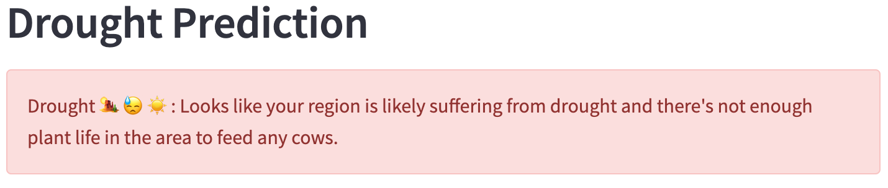

# Drought Detection

This is a project for satellite-based prediction of forage conditions for livestock in Northern Kenya (data source: https://wandb.ai/wandb/droughtwatch/benchmark). It uses deep learning (CNN Efficient Net model) to predict drought conditions from satellite images and produces a simple-to-use webapp through which users can get predictions for their uploaded satellite images.

This project is based off data from the Weights and Biases benchmark, Drought Watch. The relevant github repository and further details can be found here: 
https://github.com/wandb/droughtwatch

# Data

The current dataset consists of 86,317 train and 10,778 validation satellite images, 65x65 pixels each, in 10 spectrum bands, with 10,774 images withheld to test long-term generalization (107,869 total). Human experts (pastoralists) have labeled these with the number of cows that the geographic location at the **center** of the image could support (0, 1, 2, or 3+ cows). Each pixel represents a 30 meter square, so the images at full size are 1.95 kilometers across. Pastoralists are asked to rate the quality of the area within 20 meters of where they are standing, which corresponds to an area slightly larger a single pixel. Since forage quality is correlated across space, the larger image may be useful for prediction. 

The data is in TFRecords format, split into ``train`` and ``val``, and takes up ~4.3GB (2.15GB zipped). 
You can [learn more about the format of the satellite images here](https://developers.google.com/earth-engine/datasets/catalog/LANDSAT_LC08_C01_T1_RT).

The data used in this research was collected through a research collaboration between the International Livestock Research Institute, Cornell University, and UC San Diego. It was supported by the Atkinson Centre for a Sustainable Future’s Academic Venture Fund, Australian Aid through the AusAID Development Research Awards Scheme Agreement No. 66138, the National Science Foundation (0832782, 1059284, 1522054), and ARO grant W911-NF-14-1-0498.

# Model

The model was developed and trained using TensorFlow 2. We use CNNs based on an EfficientNet algorithm (https://github.com/google/automl/tree/master/efficientnetv2#readme). EfficientNet is a convolutional neural network architecture and scaling method that uniformly scales all dimensions of depth/width/resolution using a compound coefficient. Efficient net models use neural architecture search (NAS) to jointly optimize model size and training speed, and are scaled up in a way for faster training and inference speed. These models are associated with fewer parameters without any degradation of the top-1 classification accuracy and perform better than algorithms such as ResNet, SENet, NASNet-A  and AmoebaNet-C.

# Webapp

## On the homepage you can upload an image from your device or directly drag and drop an image:

## you're then shown the image you've uploaded:

## below this, you are then shown the prediction by the model:

## and then below this, you then get a visual breakdown of drought risk:

# Additional material and references

Coming soon !
